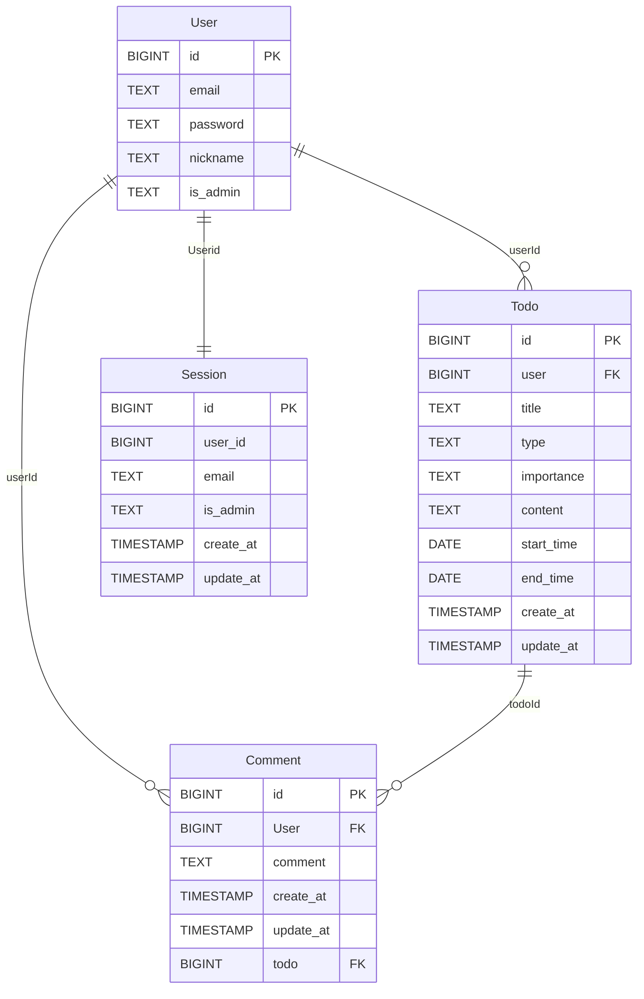
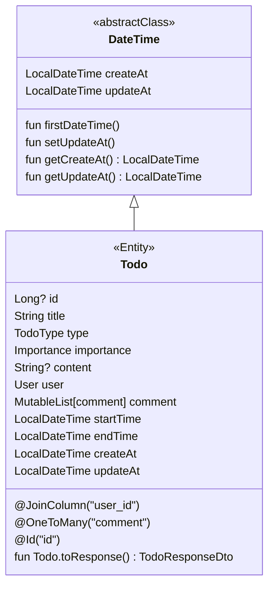
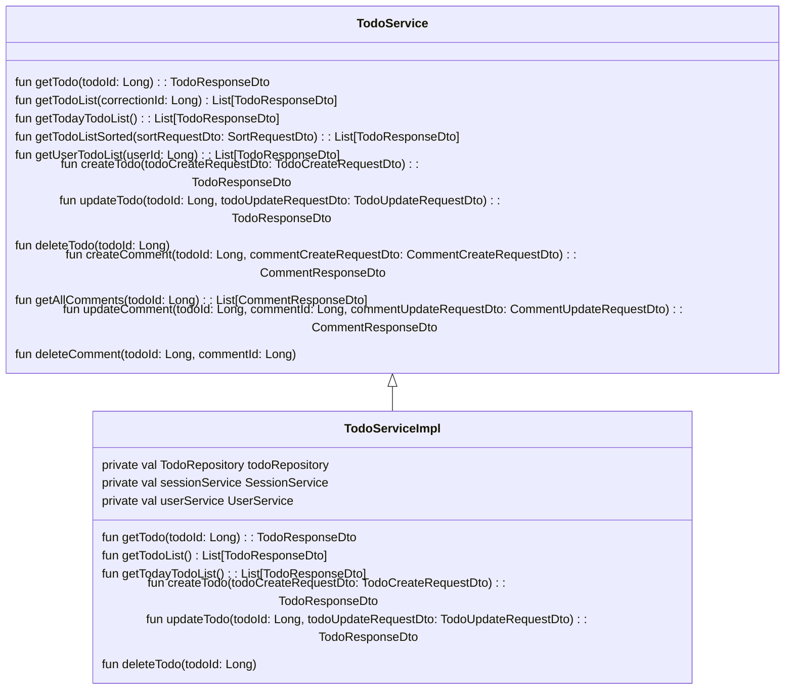
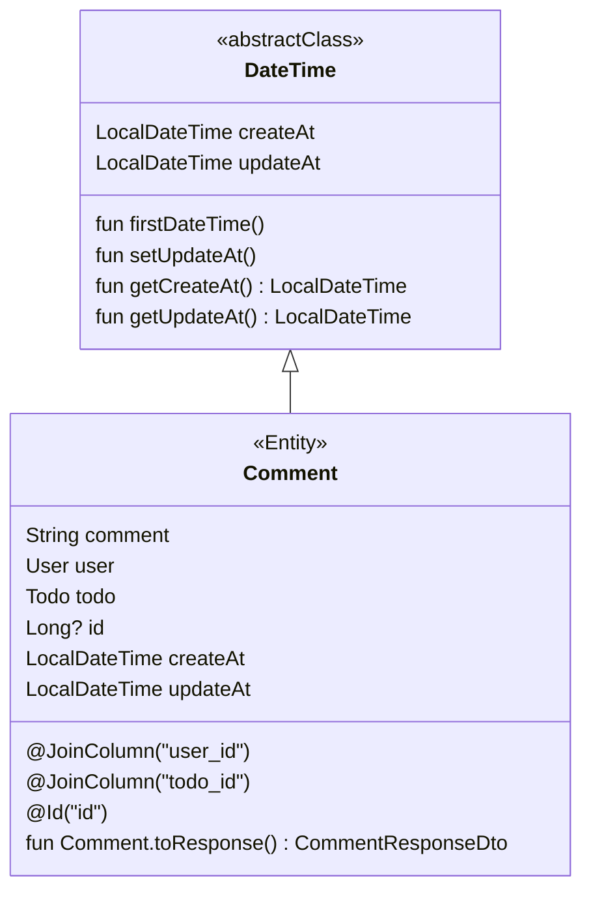
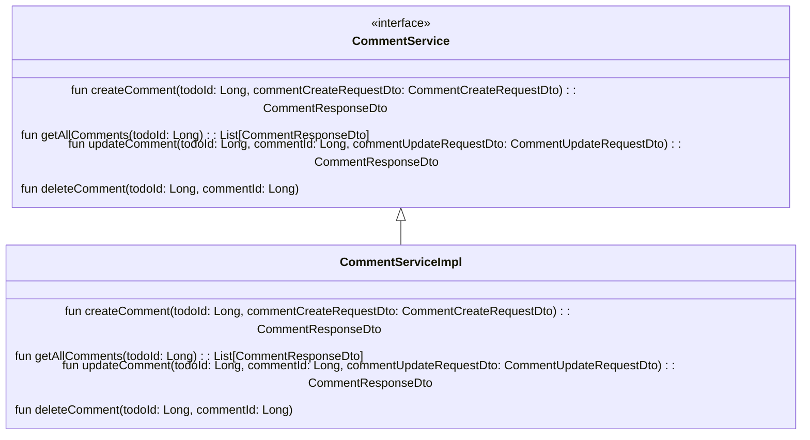
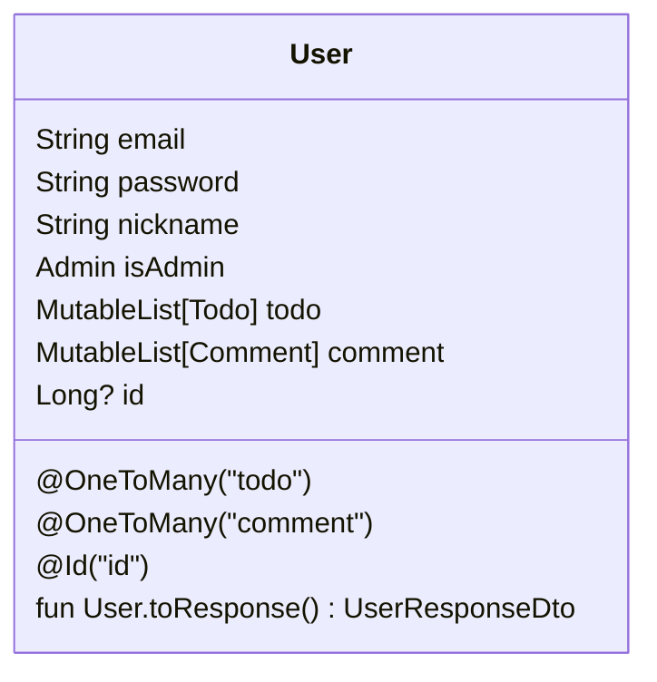
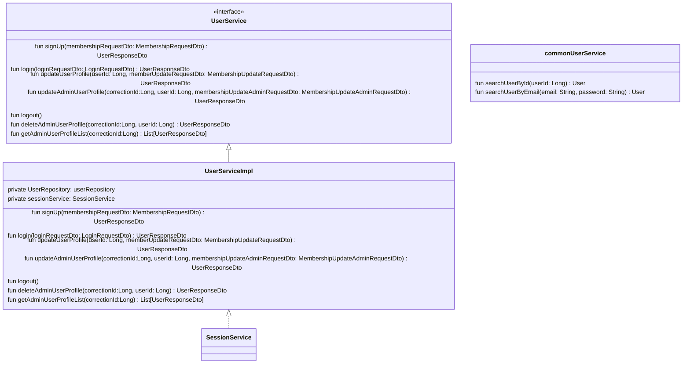

# TODO 앱 기본 구성

## Step 3 까지 전체 구현 완료 및 Step 4는 인증 인가 권한 부분만 추가 하였습니다 Step 4는 시간이 없어서 나머지 부분은 이론만 정리 해서 올렸습니다
[이론](https://github.com/Ppajingae/HW_todo/blob/test/Step4.md)

## 목차
1. [전체 적인 앱 구상도
](#1-앱-구상도)

2. [ERD](#2-erd)

3. [각 클래스의 구조도](#3-각-클래스의-구조도)

4. [HotsPot](#4-hotspot)

5. [기타 버그 및 수정 사항](#5-기타-버그-및-수정-사항)


### 1. 앱 구상도


<details>
<summary style="font-size: 18px; font-weight: bold"> 1. 전체 적인 앱 기능</summary>
<div markdown="1">     

##### TODO

- TODO 는 전체 적인 할 일을 CRUD 해주는 기능 입니다

- 각 유저는 자신의 정보를 CRUD 할 수 있고 관리자는 전체 정보를 CRUD 할 수 있습니다

- 추가적 으로 관리자는 특정 유저의 글을 수정 / 삭제가 가능 합니다

- 전체 정보 조회는 금일 날짜만 조회하는 기능과 전체 할일 리스트를 조회하는 기능을 추가할 예정 입니다

##### Comment

- Comment 는 user의 댓글을 CRUD 해주는 기능 입니다

- 댓글의 수정은 user 만 할 수 있습니다, 관리자는 댓글을 수정 하지 못하고 바로 삭제만 가능 합니다

##### User

- User는 사용자의 이메일과 비밀번호를 로그인 하여 프로필을 수정 후에 유저가 로그아웃 하는 작업을 진행 합니다

- 추가로 관리자는 프로필을 수정할 시에 일반 유저의 정보를 수정할 수 있으며 (비밀번호 제외) 유저 에게 관리자 권한을 부여할 수 도 있다

- 관리자는 일반 유저의 정보를 삭제할 수 있다

##### Session

- 유저가 로그인을 할 시에 로그인 정보를 담아 주는 역할을 한다
- `User`를 도와서 Session 검증 해주는 역할을 하며 이 부분은 아직 보완이 필요한 상태로 보여서 추후에 리펙토링 예정이다
</div>
</details>


### 2. ERD


- #### User
  
  - PK인 ID와 ```email```, ```password```, ```nickName``` 을 기본 적인 데이터로 사용 합니다

  - ```isAdminister``` 는 기본적 으로 ```false``` 값으로 부여할 예정 이며 관리자 권한 아래 true로 바꾸게끔 설정 된다

  - ```Comment``` 테이블과 ```Todo``` 테이블의 관계는 1 : N 관계를 유지할 생각 입니다 

  - 다만 ```Comment```와 ```Todo```는 ```null```일 수도 있기 때문에 위와 같이 작성 했습니다

  - 각각의 테이블은 ```userId```로 외래키 관계를 맺게 됩니다

- #### Comment

  - PK인 ID와 `comment` 를 기본 적인 데이터로 사용 합니다

  - `Comment` 테이블과 `Todo` 테이블, `User` 테이블의 관계는 N : 1 관계 이므로 각각 `user`와 `todo`를 사용 하여 외래키를 보관 합니다
  
  - `createAt`과 `updateAt`을 이용 하여 작성 시간과 업데이트 시간을 업데이트 예정 입니다

- #### Todo
    
  - PK인 ID와 `title`, `type`, `importance`, `content`, `startTime`, `endTime` 을 기본 적인 데이터로 사용 합니다

  - `type`과 `importance`를 통해서 할 일의 구조와 중요도를 파악 할 예정 입니다

  - `startTime`과 `endTime`을 통해서 할 일의 시작 시간과 종료 시간을 파악할 예정 입니다

  - `Comment` 테이블과는 1 : N 관계라 외래키를 `Comment`가 보관 할 예정 이지만 `User` 테이블의 관계는 N : 1 관계로 `User` 에 대한 외래키를 보관 합니다

  - `createAt`과 `updateAt`을 이용 하여 작성 시간과 업데이트 시간을 업데이트 예정 입니다

  - `todo` 는 SoftDelete 를 구현 하였습니다 해당 부분은 `isDeleted` 를 true 로 바꾸어 설정을 하였습니다

- #### Session

  - `User`와 OneToOne 관계 이지만 보다 범용성 있게 사용 하기 위해서 외래키 제약은 걸지 않고 구현 하였습니다

  - `updateAt`은 기본 6시간 이후에 만료 되는 것으로 설정을 하였습니다 

### 3. 각 클래스의 구조도

#### 3-1. TODO List


  - `Comment` Entity 와 `Todo` Entity 모두 `createAt`, `updateAt`을 모두 필요로 하고 `createAt`, `updateAt`을 구현 하는 로직도 비슷 합니다 따라서 `abstract class` `DateTime`을 만들어 이 둘을 동시에 관리함은 물론 추후에 필요할 경우 재정의 할 수 있는 부분 까지 대비 하였습니다
  - 각각 `toResponse`라는 확장 함수 를 구현 하여 ResponseDto 를 Return 할 수 있도록 구현 하였습니다


  - 서비스는 `TodoService`를 `TodoServiceImpl`가 상속을 받으면서 안에서 `Comment` 및 `Todo`의 비즈니스 로직을 관리 합니다
  - 그외 컨트롤러 구성은 위에 서비스에 맞게 맵핑하여 구성하였습니다

#### 3-2. Comment


- 피드백 이 후로 이것을 분리를 시킬지 고민 하다 Step2와 3의 과제를 보고 분리를 하는 것이 나을 것 같이사 Comment를 분리 하였습니다
- 분리만 했을 뿐 로직은 이전과 같습 니다(권한 부분 제외)



- 피드백 이후로 마찬가지로 분리 하였습니다 이외 로직은 동일 합니다(권한 부분 제외)


#### 3-3. User


 - Entity는 다른 Entity와 마찬가지로 필요한 상황에 맞게 맵핑을 해서 그게 다른 부분은 없지만 `createAt`, `updateAt`이 필요 하지 않을 것으로 판단 되어 따로 `DateTime()` 함수를 따로 상속 받지 않았습니다

 - `toResponse`라는 확장 함수 를 구현 하여 ResponseDto 를 Return 할 수 있도록 구현 하였습니다


 - 서비스는 `UserService`를 `UserServiceImpl`가 상속을 받으면서 안에서 `User` 의 비즈니스 로직을 관리 합니다
 - 그외 컨트롤러 구성은 위에 서비스에 맞게 맵핑하여 구성하였습니다
 - `User`는 현재 시간 부족 으로 `Signup` 함수만 구현한 후에 나머지 함수는 아직 구현 되지 않았습니다 
 - commonUserService에는 보다 다른 Service 객체 에서 사용 할 수 있는 함수들만 모아봤습니다 이 것을 통해서 조금 더 DI에 가까워 졋다고 생각은 합니다(사실상 용도 별로 구분해 놓은 거긴 합니다)

### Jwt 인증 방식

 - 기존에 session 인증 방식을 삭제 하고 Spring Security 를 활용한 Jwt 인증 방식을 사용 하였습니다

 - Spring Security 의 chain 이 동작 하는 과정에서 jwt 토큰을 인증 하는 방식 으로 구성 하였습니다

### Kakao OAuth 인증 방식

- Kakao OAuth 인증 방식을 구현 하려 했으나 인증 토큰을 받아 오고 이 후에 어떤 방법 으로 구현 해야 할 지 몰라서 우선 보류 하였습니다   

### 4. HotsPot

 -  `user`와 `administer` 사이에 중간 권한을 추가 하여 해당 권한을 부여 받은 유저는 Todo 의 조회 / 수정만 진행 하는 방식

 - `administer` 기준 전체`user`의 할 일 전체 리스트를 조회 할 것인지 아니면 개인 것만 조회 하고 필요에 따라 다른 API 를 추가 할 것 인지에 대한 확정 사항 없음

 - `todo` 에 softDelete 기술을 적용 하여 `isDeleted` 를 `true` 로 설정 하여 진행 하였 지만 해당 부분에 대한 삭제 정책이 완벽 하게 구현이 되어 있지는 않습니다 추가 적으로 해당 부분은 정책 검토 예정 입니다


### 5. 기타 버그 및 수정 사항

#### 5-1 BeanCreationException: Ambiguous mapping. 애러 발생
- 해당 애러는 맵핑이 겹치 면서 발생한 애러 라고 한다 따라서 애러 코드를 따라서 맵핑이 겹칠 만한 부분을 찾아서 해결해 주었습니다
- 해당 애러가 발생한 원인 으로 API 설계도를 작성 할 때에 `todo`와 `comment` 사이의 URL을 중복되게 작성하여 발생한 현상 으로 해당 부분은 설계도 작성시 한번더 고려 해서 작성이 필요해 보입니다
#### AS-IS

```
@RestController
@RequestMapping("/todo")
class TodoController {

@RestController
@RequestMapping("/todo/{todo_id}")
class CommentController {
```

//2
#### TO-BE
```
@RestController
@RequestMapping("/todo")
class TodoController {

@RestController
@RequestMapping("/todo/{todo_id}/comment")
class CommentController {
```

//1
#### 5-2 LoggingFailureAnalysisReporter 애러 발생

  - 애러 내용
  ```
  Description:
  
  Parameter 0 of constructor in com.example.mytodo.domain.todo.service.TodoServiceImpl required a bean of type 'com.example.mytodo.domain.todo.repository.TodoRepository' that could not be found.
  ```
  - 해결 과정 <- 해당 문제는 튜터님들과 같이 고민 했습니다

    1. 최초 원인은 위에 애러 내용과 같이 Bean 주입의 문제로 확인 했습니다 이에 에러가 발생한 지점인 `Repository`와 `Service`, `Entity`의 Bean 등록 상태을 확인 하였습니다 : 특이 사항 없음 확인 
    2. DB의 Entity 연결 여부를 확인 하였습니다 DB가 Entity에 데이터 주입이 되어 있지 않은 상태에서 발생할 애러일 가능성도 고려하여 데이터 주입을 시도하였습니다 : 특이 사항 없음 확인
    3. Import 문을 확인 하여 외부 라이브러리가 잘못 연결 되어있는지 확인 하였습니다 : 특이 사항 없음 확인
    4. 기존에 붙어 있던 Annotation 문제가 있을 수도 있을 것으로 판단되어 Annotation 지우고 재주입 시도하였습니다 : 특이 사항 없음 확인
    5. `@AutoWired` Annotation `@ComponentScan`등을 사용 하여 Bean 직접 주입하거나 Repository 경로를 수동 으로 지정해 주었습니다 : 같은 애러 현상 지속적으로 발생 확인
    6. 코드 검사 과정에서 `build.gradle.kts`에서 빼 먹은 부분이 확인되어 빼 먹은 부분 전부 추가 진행 : 특이 사항 없음 확인
       - 추가한 코드
       ```
       noArg {
        annotation("jakarta.persistence.Entity")
        annotation("jakarta.persistence.MappedSuperclass")
        annotation("jakarta.persistence.Embeddable")
        }
    
       allOpen {
        annotation("jakarta.persistence.Entity")
        annotation("jakarta.persistence.MappedSuperclass")
        annotation("jakarta.persistence.Embeddable")
        }
       ```
    7. Spring Boot 버전 다운그레이드 3.2.5 -> 3.1.0 : 특이 사항 없음 확인
    8. `Comment`와 `Todo` Entity가 상속 받고 있는 `DateTime` 클래스 를 상속 해제 및 해당 클래스에도 수동으로 Bean 주입을 시도하였습니다 : 특이 사항 없음 확인
    9. 새로운 프로젝트에 기본 값만 추가 후에 기존에 코드 복사 후에 붙여넣기 시도 : 같은 애러 발생 하였으나 기존 프로젝트를 처음 시도할 때 발생한 애러 발생 하여 구글링하여 찾아본 값을 `application.yml` 에 주입 <- 해당 문제는 프로젝트를 만들때 빌드하자마자 발생하였습니다
       - 발생한 애러
       ```
        org.springframework.beans.factory.UnsatisfiedDependencyException: 
       Error creating bean with name 'dataSourceScriptDatabaseInitializer' defined in class path resource [org/springframework/boot/autoconfigure/sql/init/DataSourceInitializationConfiguration.class]: 
       Unsatisfied dependency expressed through method 'dataSourceScriptDatabaseInitializer' 
       parameter 0: Error creating bean with name 'dataSource' defined in class path resource [org/springframework/boot/autoconfigure/jdbc/DataSourceConfiguration$Hikari.class]: 
       Failed to instantiate [com.zaxxer.hikari.HikariDataSource]: Factory method 'dataSource' threw exception with message: 
       URL must start with 'jdbc'
       ```
       ```
        spring:
           autoconfigure:
              exclude: org.springframework.boot.autoconfigure.jdbc.DataSourceAutoConfiguration
       ```
    10. 가장 문제가 되는 `TodoRepository`를 주석 처리 한 후에 해당 생성자를 받고 있는 다른 클래스도 생성자 제거를 진행하였습니다 : `CommentRepository`에서 위와 같은 애러 확인
    11. 위와 같은 애러 확인 후에 다른 `Repository`에도 같은 식으로 주석 및 생성자 삭제를 진행하였습니다 : 정상 빌드 확인, Repository 연결 문제 확인
    12. 환경 변수 문제 가능성도 있는 상황에서 환경 변수를 확인 하는 과정에서 환경 변수에 Port 번호가 누락이 되어 있어서 작성 해주었습니다 : 애러 로그 변경
    13. `application.yml` 파일 에서 아래의 문구 삭제 : 정상 작동 확인
      ```
       spring:
           autoconfigure:
              exclude: org.springframework.boot.autoconfigure.jdbc.DataSourceAutoConfiguration
      ```
  - 결론
    - 처음에는 Bean 주입 문제로 확인 하고 해결을 시도 하였으나 확인해보니 환경변수의 Port 번호가 누락된 시점 에서 `application.yml`의 변경을 시도 하면서 빌드 과정에서 꼬인 것으로 확인 하였습니다
#### AS-IS

  ```
    SPRING_DATASOURCE_URL=jdbc:postgresql://aws-0-ap-northeast-2.pooler.supabase.com/postgres?user=postgres.jisckkofuptsqjyfhklh&password=PASSWORD
  
  ```
- `application.yml`
  ```
    spring:
       autoconfigure:
           exclude: org.springframework.boot.autoconfigure.jdbc.DataSourceAutoConfiguration
  ```
#### TO-BE
- 환경 변수
  ```
    SPRING_DATASOURCE_URL=jdbc:postgresql://aws-0-ap-northeast-2.pooler.supabase.com:5432/postgres?user=postgres.jisckkofuptsqjyfhklh&password=PASSWORD
  
  ```
- `application.yml` 파일에 위 문구를 삭제 하였습니다

#### 5-3 POST 요청 시에 HttpMessageNotReadableException 애러 발생

- 애러 내용
```
JSON parse error: Illegal unquoted character ((CTRL-CHAR, code 8)): has to be escaped using backslash to be included in string value]
```
- 원인
  - 문자열 앞에 공백 등이 있을 경우에 JSON이 Parse 되지 않는 현상

- 해결
  - 문자열을 입력할 때 `trim()` 함수 사용

#### AS-IS

### 5-4 complete 변수 swagger 에서 적용이 되지 않는 문제

- 애러 내용

  - isComplete 라는 변수 선언 시 swagger 에서 complete, isComplete까지 같이 생성 되는 문제

  - 위 문제 해결 이후에 변수에 값을 입력할 시 제대로 변경 되지 않는 문제

  - 원인
      - 코드 상 에서는 특이 사항이 없는 부분 으로 확인 되었고 다만 동일 동일 변수를 다른 입력 값으로 입력 시에 추가 적인 부분이 생성 되지 않는 것으로 봤을 때 Swagger 쪽에서 자동 으로 판단 하고 만든 변수 라는 판단이 든다
  - 해결
      - isComplete 변수는 모두 complete로 변경
      - 변수에 값 입력 문제는 `TodoUpdateRequestDto`에 complete 누락이 확인 되어서 다시 정의 후 정상 확인
  


### 6. 환경 설정

- Swagger.ui 접근 주소 : http://localhost:8080/swagger-ui/index.html

- IDE : IntelliJ unlimited

- Language : Kotlin

- JDK.ver : temurin-18.0.2.1

- Kotlin.ver : 1.9.20

- SpringBoot.ver : 3.2.5

- Spring.ver : 1.9.23

- JPA.ver : 1.9.23

