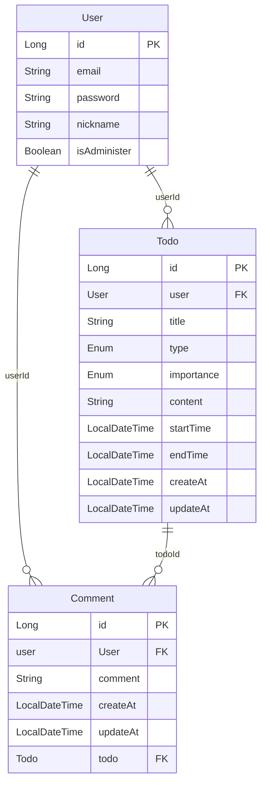

# TODO 앱 기본 구성

## 목차
1. [전체 적인 앱 구상도
](#1-앱-구상도)

2. [ERD](#2-erd)

3. [각 클래스의 구조도](#3-각-클래스의-구조도)

4. [HotsPot](#4-hotspot)

5. [기타 버그 및 수정 사항](#5-기타-버그-및-수정-사항)


### 1. 앱 구상도


<details>
<summary style="font-size: 18px; font-weight: bold"> 1. 전체 적인 앱 기능</summary>
<div markdown="1">     

**전체 적으로 크게 2개의 aggregate 로 분류를 하였습니다**

#### TODO List Aggregate

- TODO List Aggregate 는 큰 시각 에서 봤을 때 유저의 할일을 CRUD 로 받아 주는 기능이 있습니다

- 크게 2가지의 기능 으로 나뉘며 메인 으로 할 일들을 받아주고 처리 해주는 TODO 기능과 해당 기능에 코맨트를 달 수 있는 코맨트 기능이 있습니다

##### TODO

- TODO 는 전체 적인 할 일을 CRUD 해주는 기능 입니다

- 각 유저는 자신의 정보를 CRUD 할 수 있고 관리자는 전체 정보를 CRUD 할 수 있습니다

- 추가적 으로 관리자는 특정 유저의 글을 수정 / 삭제가 가능 합니다

- 전체 정보 조회는 금일 날짜만 조회하는 기능과 전체 할일 리스트를 조회하는 기능을 추가할 예정 입니다

##### Comment

- Comment 는 user의 댓글을 CRUD 해주는 기능 입니다

- 댓글의 수정은 user 만 할 수 있습니다, 관리자는 댓글을 수정 하지 못하고 바로 삭제만 가능 합니다

##### User Aggregate

- User는 사용자의 이메일과 비밀번호를 로그인 하여 프로필을 수정 후에 유저가 로그아웃 하는 작업을 진행 합니다

- 추가로 관리자는 프로필을 수정할 시에 일반 유저의 정보를 수정할 수 있으며 (비밀번호 제외) 유저 에게 관리자 권한을 부여할 수 도 있다

- 관리자는 일반 유저의 정보를 삭제할 수 있다
</div>
</details>


### 2. ERD


- #### User
  
  - PK인 ID와 ```email```, ```password```, ```nickName``` 을 기본 적인 데이터로 사용 합니다

  - ```isAdminister``` 는 기본적 으로 ```false``` 값으로 부여할 예정 이며 관리자 권한 아래 true로 바꾸게끔 설정 된다

  - ```Comment``` 테이블과 ```Todo``` 테이블의 관계는 1 : N 관계를 유지할 생각 입니다 

  - 다만 ```Comment```와 ```Todo```는 ```null```일 수도 있기 때문에 위와 같이 작성 했습니다

  - 각각의 테이블은 ```userId```로 외래키 관계를 맺게 됩니다

- #### Comment

  - PK인 ID와 `comment` 를 기본 적인 데이터로 사용 합니다

  - `Comment` 테이블과 `Todo` 테이블, `User` 테이블의 관계는 N : 1 관계 이므로 각각 `user`와 `todo`를 사용 하여 외래키를 보관 합니다
  
  - `createAt`과 `updateAt`을 이용 하여 작성 시간과 업데이트 시간을 업데이트 예정 입니다

- #### Todo
    
  - PK인 ID와 `title`, `type`, `importance`, `content`, `startTime`, `endTime` 을 기본 적인 데이터로 사용 합니다

  - `type`과 `importance`를 통해서 할 일의 구조와 중요도를 파악 할 예정 입니다

  - `startTime`과 `endTime`을 통해서 할 일의 시작 시간과 종료 시간을 파악할 예정 입니다

  - `Comment` 테이블과는 1 : N 관계라 외래키를 `Comment`가 보관 할 예정 이지만 `User` 테이블의 관계는 N : 1 관계로 `User` 에 대한 외래키를 보관 합니다

  - `createAt`과 `updateAt`을 이용 하여 작성 시간과 업데이트 시간을 업데이트 예정 입니다

### 3. 각 클래스의 구조도

### 4. HotsPot

 -  `user`와 `administer` 사이에 중간 권한을 추가 하여 해당 권한을 부여 받은 유저는 Todo 의 조회 / 수정만 진행 하는 방식

 - `administer` 기준 전체`user`의 할 일 전체 리스트를 조회 할 것인지 아니면 개인 것만 조회 하고 필요에 따라 다른 API 를 추가 할 것 인지에 대한 확정 사항 없음


### 5. 기타 버그 및 수정 사항

#### AS-IS

#### TO-BE

### 6. 환경 설정

- IDE : IntelliJ unlimited

- Language : Kotlin

- JDK.ver : temurin-18.0.2.1

- Kotlin.ver : 1.9.20

- SpringBoot.ver : 3.2.5

- Spring.ver : 1.9.23

- JPA.ver : 1.9.23

